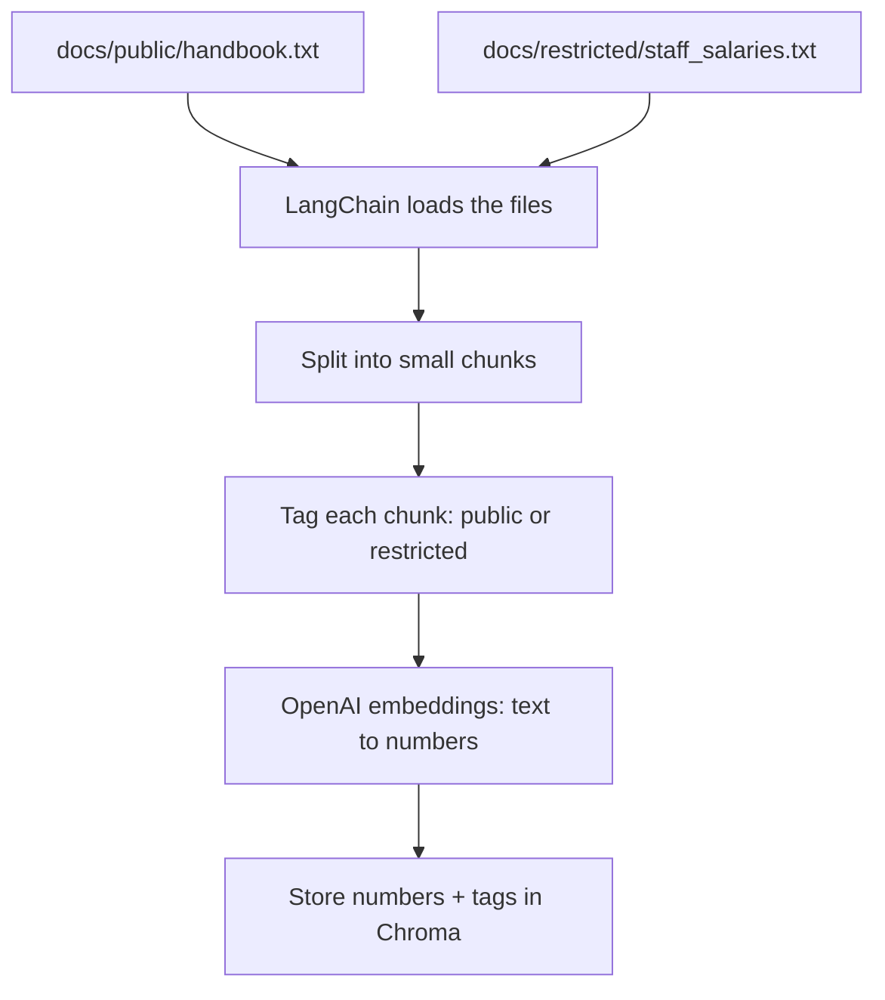
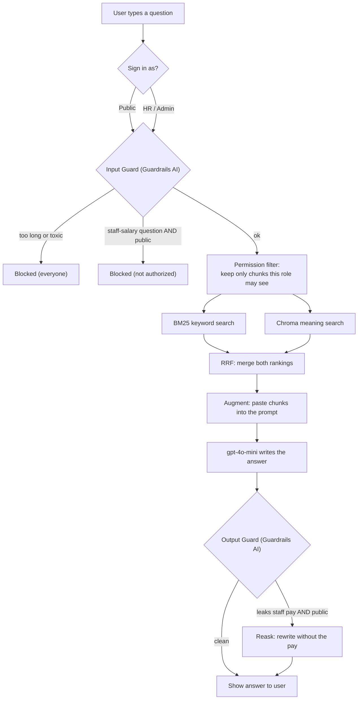
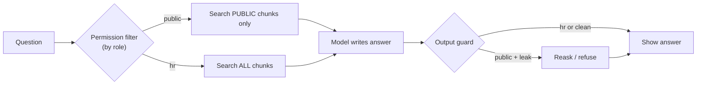

# 🏗️ Chat With Your Notes — Architecture (Simple Version)

A plain-language map of how the whole app works and what tech does each job.
If you can read this, you can explain the app to anyone.

---

## 🧠 The big idea in one line
> You give it documents. You ask questions. It finds the right piece of your
> documents and the AI answers from it — **safely**, and **only what you're
> allowed to see**.

---

## 🔧 The tech, and the one job each does

| Tool | Its one job | Plain-English name |
|---|---|---|
| **Streamlit** | The chat website you type into | The front desk |
| **LangChain** | Connects all the steps together | The recipe / glue |
| **OpenAI `text-embedding-3-small`** | Turns text into numbers (meaning) | The translator |
| **Chroma** | Stores those numbers + searches them | The librarian |
| **BM25** | Keyword search (exact words) | The index at the back of a book |
| **RRF** | Merges keyword + meaning results | The judge that ranks both |
| **OpenAI `gpt-4o-mini`** | Writes the final answer | The writer |
| **Guardrails AI** | Safety checks on input & output | The security guard |
| **Permission filter** | Decides which docs you may search | The keycard / access control |

**Everything is free except the two OpenAI models** (a few cents to run).

---

## 📦 PHASE 1 — Ingest (run once: "studying the documents")

```
  docs/public/handbook.txt          docs/restricted/staff_salaries.txt
        │                                      │
        └──────────────┬───────────────────────┘
                       ▼
              [ LangChain loads files ]
                       │
                       ▼
              [ Split into small chunks ]        ← RecursiveCharacterTextSplitter
                       │
                       ▼
        [ TAG each chunk: public or restricted ] ← permission metadata
                       │
                       ▼
     [ OpenAI embeddings: text → numbers ]       ← text-embedding-3-small
                       │
                       ▼
        [ Store numbers + tags in Chroma ]       ← chroma_db/ folder
```
**Result:** a searchable database where every chunk knows (a) its meaning-numbers
and (b) who is allowed to see it.

---

## 💬 PHASE 2 — Ask a question (runs every time)

```
                    ┌─────────────────────────────────────┐
   You type  ─────► │   Streamlit chat  +  "Sign in as:"   │   role = public / hr
   a question       └──────────────────┬──────────────────┘
                                       ▼
                    ┌──────────────────────────────────────┐
                    │  GUARD 1 — INPUT (Guardrails AI)      │
                    │  • too long? toxic?  → block (anyone) │
                    │  • about staff salary? → block        │
                    │       (ONLY if you're 'public')       │
                    └──────────────────┬───────────────────┘
                                       │ passes
                                       ▼
                    ┌──────────────────────────────────────┐
                    │  RETRIEVE — search YOUR allowed docs  │
                    │                                       │
                    │   ┌── BM25 keyword search ──┐         │
                    │   │                          ├─ RRF ──┼──► best chunks
                    │   └── Chroma meaning search ─┘         │
                    │                                       │
                    │   🔑 permission filter: a 'public'    │
                    │      user only ever searches PUBLIC   │
                    │      chunks — the salary chunk is      │
                    │      NEVER fetched for them.           │
                    └──────────────────┬───────────────────┘
                                       ▼
                    ┌──────────────────────────────────────┐
                    │  AUGMENT — paste chunks into a prompt │  ← LangChain template
                    └──────────────────┬───────────────────┘
                                       ▼
                    ┌──────────────────────────────────────┐
                    │  GENERATE — AI writes the answer      │  ← gpt-4o-mini
                    └──────────────────┬───────────────────┘
                                       ▼
                    ┌──────────────────────────────────────┐
                    │  GUARD 2 — OUTPUT (Guardrails AI)     │
                    │  • does the answer leak staff pay?    │
                    │       (ONLY checked if 'public')      │
                    │  • if leak → REASK: rewrite without it│
                    └──────────────────┬───────────────────┘
                                       ▼
                              Answer shown to you
```

---

## 🔐 The two safety layers (don't mix them up)

```
LAYER 1 — PERMISSION FILTER   "the wall"
   Decides WHICH documents you can search, based on your role.
   Public user can't even look in the salary file.
   → The model can't leak what it never received.

LAYER 2 — GUARDRAILS          "the backup net"
   • Generic checks (too long / toxic)  → apply to EVERYONE
   • Salary checks (input + output)      → apply to PUBLIC only (HR skips them)
   • If a leak slips through             → REASK rewrites it cleanly
```

---

## 👤 Same question, two roles (the whole point)

```
"What is the teacher salary?"

  PUBLIC user                         HR / ADMIN user
  ───────────                         ───────────────
  input guard: about pay? YES         input guard: SKIPPED (authorized)
        → BLOCKED 🚫                   retrieve: searches BOTH rooms
                                       finds salary chunk
                                       AI answers "60,000 rupees" ✅
```

---

## 🗺️ Which roadmap phase each part covers

| Part of the app | Roadmap phase |
|---|---|
| Embeddings + Chroma | Phase 2 — Embeddings & Vector DB |
| Chunking, retrieve, BM25, RRF, hybrid | Phase 3 — RAG |
| LangChain loaders / splitters / prompts | Phase 4 — Frameworks |
| Guardrails + permission filtering | Phase 6 — Production safety |

---

## 🗣️ Say this out loud and you've explained the whole app
> "Documents are split into chunks, turned into meaning-numbers by an embedding
> model, and stored in Chroma with a tag for who can see them. When you ask a
> question, a guard checks it, then the app searches **only the chunks you're
> allowed to see** — using both keyword and meaning search, merged with RRF. The
> best chunks go to gpt-4o-mini, which writes the answer. A final guard checks the
> answer for leaks and rewrites it if needed. That whole pattern is **secure RAG**."

---

## 📊 Mermaid diagrams (render in GitHub / VS Code preview)

> To view: open this file's **Markdown Preview** in VS Code (Ctrl+Shift+V).
> If diagrams don't render, install the "Markdown Preview Mermaid Support" extension.

### Diagram 1 — Ingest (run once)



### Diagram 2 — Asking a question (every time)



### Diagram 3 — The two safety layers (zoomed in)



